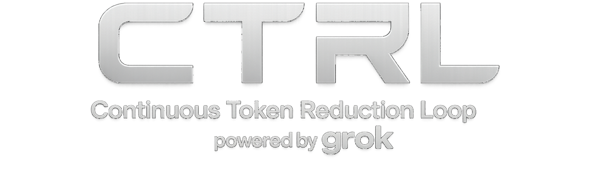

# CTRL

  

<strong>Continuous Token Reduction Loop</strong> AI-orchestrated buyback + burn system running every 69 seconds.

  
  
  
  
  

## Overview

CTRL is split into a dashboard + API stack and an autoburn worker:

- `ctrl-burn-dashboard-main/ctrl-burn-dashboard-main`: public dashboard, live API, websocket feed, chart, token metrics
- `autoburner`: on-chain worker that claims creator rewards, buys token, burns token, repeats on interval
- `constant-token-reduction-loop-profile`: profile-style README content for GitHub presentation

## Core Flow

1. Claim creator rewards.
2. Route funds into buyback.
3. Burn purchased tokens.
4. Publish status/logs/metrics to dashboard.
5. Repeat every loop interval (`69s` target).

## Runtime Components

### Dashboard + API

- Frontend: React + Vite + Tailwind
- Backend: Node server with REST + WS
- Market data: GeckoTerminal + DexScreener integrations
- Live metrics: holders, supply burned %, creator rewards, burn stats
- Runtime orchestration: **Powered by Grok 4 AI**

Main entry points:

- `ctrl-burn-dashboard-main/ctrl-burn-dashboard-main/src/pages/Index.tsx`
- `ctrl-burn-dashboard-main/ctrl-burn-dashboard-main/src/components/ctrl/Dashboard.tsx`
- `ctrl-burn-dashboard-main/ctrl-burn-dashboard-main/server/index.mjs`

### Autoburn Worker

- Main loop: `autoburner/src/auto_burner.js`
- Handles claim -> buy -> burn -> cooldown cycle
- Uses env-driven config for RPCs, wallet, mint, slippage, fees, cooldown, guards

