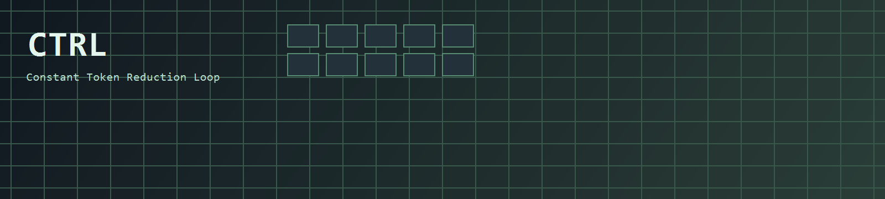
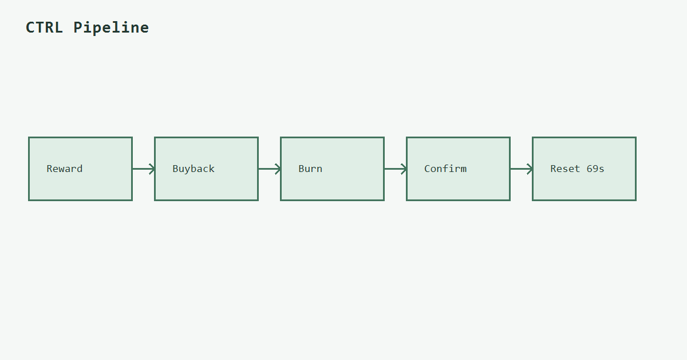
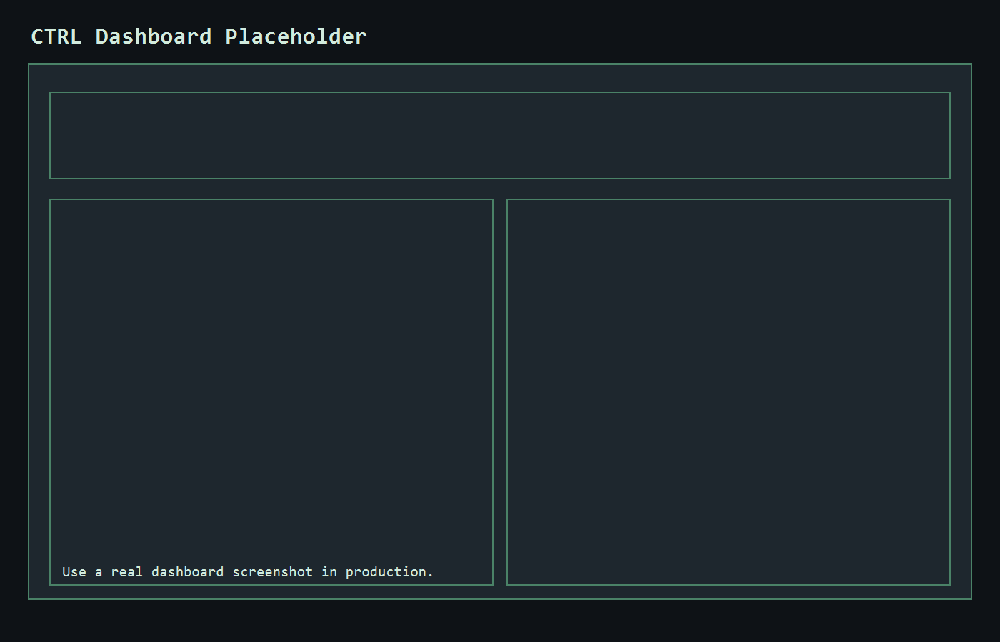

# CTRL

**Constant Token Reduction Loop. Public by default.**


[website](https://ctrl.example.com) | [x](https://x.com/ctrl_loop) | [docs](https://docs.ctrl.example.com) | [solscan](https://solscan.io/account/1nc1nerator11111111111111111111111111111111) | [security](https://github.com/constant-token-reduction-loop/ctrl/security)

---

<p align="center">
  
</p>

---

## The Lore

CTRL was built around one hard rule: **if rewards exist, reduce supply**.

Every loop claims creator-side rewards, converts SOL to CTRL, burns the acquired tokens, confirms on-chain, and resets the clock.
The dashboard is not an afterthought. It is the public control surface for the loop itself.

> "If the loop can’t prove it on-chain, it didn’t happen."

The objective is simple: sustained reduction pressure with transparent execution.

<p align="center">
  
  
</p>

---

## Architecture

CTRL runtime is a compact state engine with cached snapshots and live patches.

### Runtime Core

```text
Input Sources
- Solana RPC (wallet balance, tx signatures, token supply)
- SOL/USD feed (USD normalization)

State Engine
- cycle_seconds = 69
- status machine: WAITING -> EXECUTING_BUY -> BURNING -> CONFIRMED -> WAITING
- uptime over rolling 24h heartbeat window
- terminal event ring buffer (max 200)

Output Channels
- REST: GET /api/ctrl/state (fast snapshot)
- WS:   /api/ctrl/ws (snapshot + patch + terminal)
```

```ts
interface CtrlSnapshot {
  ctrl: Ctrl;
  serverTime: string;
  cycleSeconds: 69;
}

interface WsMessage {
  type: "snapshot" | "patch" | "terminal";
  payload: unknown;
}
```

### Frontend Integration Contract

```text
1) load /api/ctrl/state
2) connect ws /api/ctrl/ws
3) apply snapshot/patch
4) append terminal events
5) fallback to polling /api/ctrl/state every 2s on ws failure
```

---

## Pipeline

```text
[REWARD]
   |
   v
[BUYBACK]
   |
   v
[BURN]
   |
   v
[CONFIRM]
   |
   v
[RESET @ 69s]
```

```text
Event Types
- info
- reward
- buy
- burn
- confirm
- error
```

---

## Transparency

Verification steps:

1. `GET /api/ctrl/state`
2. Inspect `ctrl.lastBurn.buyTx`, `ctrl.lastBurn.burnTx`
3. Open `ctrl.lastBurn.solscanBuyUrl`, `ctrl.lastBurn.solscanBurnUrl`
4. Verify burn wallet: `ctrl.wallets.burnWalletSolscanUrl`
5. Compare `ctrl.supply.percentBurned` with on-chain supply data

---

## Quickstart

```bash
npm install
cp .env.example .env
npm run dev
```

Mock mode:

```bash
MOCK_CTRL=true npm run dev
```

Autoburner bridge mode:

```bash
# set these in .env for live worker ingestion
CTRL_WORKER_EVENTS_URL=http://127.0.0.1:8790/events
CTRL_WORKER_STATUS_URL=http://127.0.0.1:8790/status
```

Environment variables are documented in `.env.example`.

---

## API / WS Contract

### REST

`GET /api/ctrl/state`

```json
{
  "ctrl": { "...": "full object" },
  "serverTime": "ISO-8601",
  "cycleSeconds": 69
}
```

### WebSocket

`WS /api/ctrl/ws`

- `snapshot`
- `patch`
- `terminal`

---

## Roadmap

- [x] Cached snapshot endpoint
- [x] Live WS stream + terminal feed
- [x] 2s polling fallback
- [x] `MOCK_CTRL=true` simulation mode
- [ ] Persist historical totals in durable storage
- [ ] Automated schema contract tests
- [ ] Multi-RPC failover + signed event provenance

---

## License

MIT. See [LICENSE](./LICENSE).

